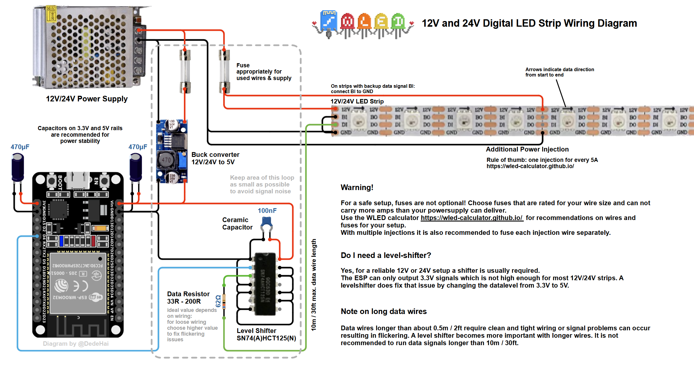

# Arbeitsjournal
~ Kilian Hornischer

### 23.09.2025

**LED Hardware**
- WS2811S-M30-LW67 LED strip (Datasheet: https://www.tme.eu/Document/26d574b43ad9ddaffa4d5bcd140ec145/WS2811.pdf)
- 30 LEDs per meter, using WS2811 protocol
- C++ code to control it

**Set Up Development Environment**
- Started with Arduino IDE 
- Transitioned to PlatformIO
- library installation methods for both environments

**Library Selection & Installation**
- Chose FastLED library (recommended for performance) (fastled/FastLED@^3.6.0)
- Alternative: Adafruit NeoPixel library
- PlatformIO dependency management via `platformio.ini`

**Code Implementation**
- Created examples for LED control
- Externer Power Supply missing to test

**Testing Piezo-Speaker**
- Pin: 5 -> D1
- Testing various frequencies

### 30.09.2025

**Planing the circuit**
- Planing and drawing the plan of the circuit (leaving out the pedal)
- Braze the Step Down 
- Building the circuit

### 07.10.2025

**Circuit correction**
- added Level Shifter
- changed circuit to following construction:

- Runlight programm written and tested (led.py)

### 14.10.2025
- Code where LED reacts to keyboard input as preperation for the pedal

### 21.10.2025